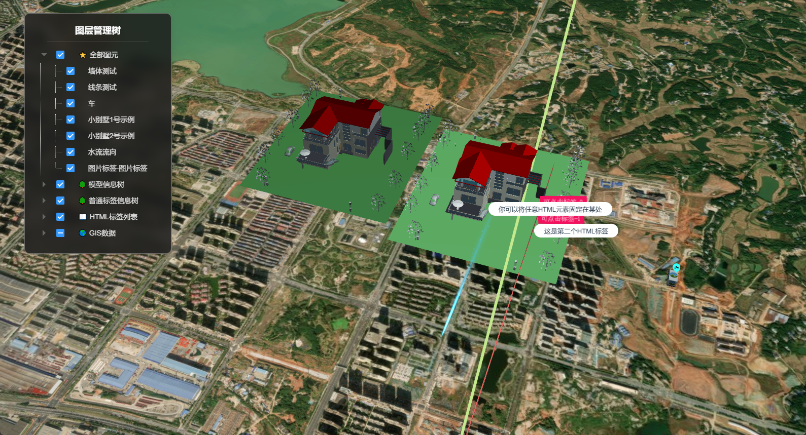

# 新增 GIS 数据图层

## 其他方法 - addImageryProvider

### 方法介绍

UniCore viewer 提供 addImageryProvider 方法用于新增 GIS 数据图层。

该方法需引入 Cesium 第三方库。

```js
import * as Cesium from 'cesium'
```

### 代码示例

你可以使用第三方的底图 API ，如天地图、ArcGIS、openstreetmap 等第三方服务。

#### 更换底图

本示例使用 openstreetmap 服务，你也可以查看 [多底图分屏组件](../fastcomponents/LayerSplitSet.md#示例运行结果) 的介绍应用。

```js
window.viewer.imageryLayers.addImageryProvider(new Cesium.UrlTemplateImageryProvider({
  url: "https://tile.openstreetmap.bzh/br/{z}/{x}/{y}.png",
  subdomains: ["a", "b", "c", "d"],
}))
```

更换前：



更换后：


#### 添加影像标注

本示例使用天地图 API ，你可以在天地图官网申请 token ，替换掉下面代码的 “你的token” 。

你可以添加影像标注，在底图显示地点文字标签。

```js
window.viewer.imageryLayers.addImageryProvider(new Cesium.WebMapTileServiceImageryProvider({
  url: "http://t0.tianditu.com/cia_w/wmts?service=wmts&request=GetTile&version=1.0.0&LAYER=cia&tileMatrixSet=w&TileMatrix={TileMatrix}&TileRow={TileRow}&TileCol={TileCol}&style=default&format=tiles&tk=你的token",
  layer: "tdtImgAnnoLayer",
  style: "default",
  format: "image/jpeg",
  tileMatrixSetID: "GoogleMapsCompatible",
  show: false
}))
```

加载前：


加载后：


